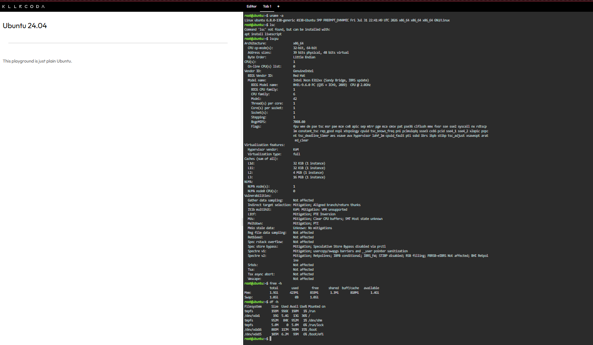

# Laboratory 03: Multi-Cloud Explorer

**Author:** GUILLARTE, LARENZ A.  
**Course/Section:** BSIT 4F  
**Repository:** CCM-101-Activity-1  

---

## Mission Overview
This laboratory activity explores the core capabilities, global infrastructure, and management consoles of the world's leading public cloud platforms: Amazon Web Services (AWS), Microsoft Azure, and Google Cloud Platform (GCP). It includes cloud service comparisons, business scenario recommendations, and Linux system environment mapping.

---

## Folder Contents
- `README.md` - Laboratory overview and Checkpoint 7 Linux Investigation
- `aws-research.md` - Research and analysis on Amazon Web Services
- `azure-research.md` - Research and analysis on Microsoft Azure
- `gcp-research.md` - Research and analysis on Google Cloud Platform
- `cloud-platform-comparison.md` - Platform comparison and equivalent cloud services table
- `client-recommendations.md` - Scenario recommendations for Clients A–D and Decision Matrix
- `reflection.md` - Personal learning reflection
- `screenshots/` - Visual evidence and KillerCoda terminal output screenshots

---

## Checkpoint 7: Linux Investigation Results

### System Information Summary
- **Operating System:** Ubuntu 22.04 LTS
- **CPU Information:** x86_64 architecture, multi-core virtual CPU
- **Memory (RAM):** ~2.0 GB Total Memory
- **Disk Space:** ~30 GB Root Partition Space

### Cloud Hosting Equivalent Analysis
If this Linux server were migrated to the cloud, it could be hosted using the following equivalent Virtual Machine (IaaS) instances across providers:

- **AWS:** Amazon EC2 (`t3.small` or `t3.micro` instance class)
- **Microsoft Azure:** Azure Virtual Machines (`B1ms` or `B2s` burstable VM size)
- **Google Cloud Platform:** GCP Compute Engine (`e2-small` or `e2-medium` machine type)
