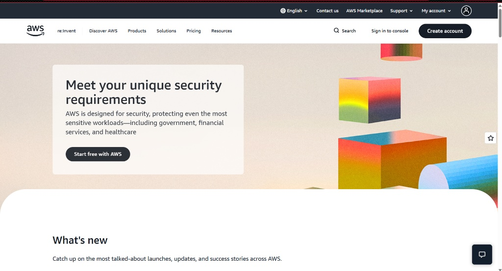

# Amazon Web Services (AWS) Research Document

## Brief Overview
Amazon Web Services (AWS) is a comprehensive and broadly adopted public cloud computing platform provided by Amazon. Launched in 2006, AWS offers a wide array of infrastructure services such as computing power, storage options, networking, and databases delivered on-demand on a pay-as-you-go basis.

## Global Infrastructure
AWS operates globally across dozens of geographic Regions and hundreds of Availability Zones (AZs). Each AWS Region consists of multiple isolated, physically separated AZs connected through low-latency, high-throughput, and highly redundant private network links. AWS also maintains Edge Locations worldwide for fast content delivery.

## Cloud Management Console
The AWS Management Console is a web-based interface that provides centralized access to create, configure, monitor, and manage AWS resources, billing accounts, and Identity and Access Management (IAM) security policies.

## Core Services
1. **Compute:** Amazon EC2 (Elastic Compute Cloud) – Provides scalable virtual servers in the cloud.
2. **Storage:** Amazon S3 (Simple Storage Service) – Highly durable, scalable object storage for files and data backups.
3. **Networking:** Amazon VPC (Virtual Private Cloud) – Allows provisioning of a logically isolated section of the AWS Cloud.
4. **Identity:** AWS IAM (Identity and Access Management) – Manages user identities, permissions, and service access control.

## Advantages
- **Extensive Service Portfolio:** Offers the deepest and broadest set of cloud capabilities and features in the market.
- **Global Footprint & Scale:** Large global capacity ensures high availability, redundancy, and regional disaster recovery.
- **Vast Partner Ecosystem:** Strong community support, third-party integration tools, and comprehensive documentation.

## Typical Enterprise Use Cases
- Large-scale enterprise cloud migrations and hybrid infrastructure hosting.
- High-traffic e-commerce web applications requiring dynamic auto-scaling.
- Big data processing, data warehousing, and serverless application backends.
