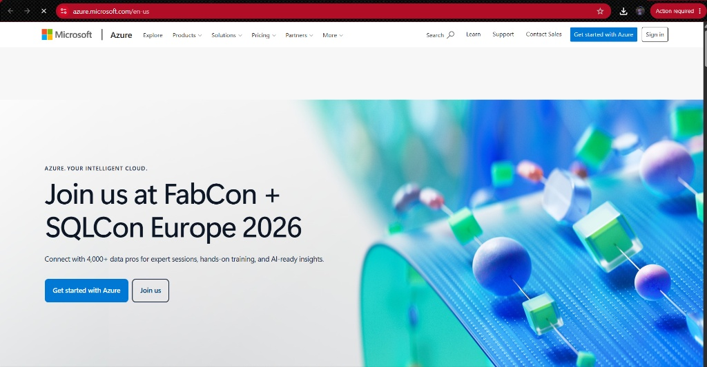

# Microsoft Azure Research Document

## Brief Overview
Microsoft Azure, launched in 2010, is Microsoft's public cloud computing platform. It provides a broad range of cloud services including compute, analytics, storage, and networking, designed to help organizations meet business challenges and integrate seamlessly with enterprise systems.

## Global Infrastructure
Azure has a vast global infrastructure consisting of datacenters across more than 60 regions worldwide. Each region features multiple Availability Zones with independent power, cooling, and networking to ensure fault tolerance and high availability.

## Cloud Management Console
The Azure Portal is a web-based, unified console that provides an alternative to command-line tools. It allows users to build, manage, monitor, and configure everything from simple web apps to complex cloud deployments.

## Core Services
1. **Compute:** Azure Virtual Machines – On-demand, scalable virtual machines for custom hosting environments.
2. **Storage:** Azure Blob Storage – Massively scalable object storage for unstructured data such as audio, video, and documents.
3. **Networking:** Azure Virtual Network (VNet) – Enables Azure resources to securely communicate with each other, the internet, and on-premises networks.
4. **Identity:** Microsoft Entra ID (formerly Azure Active Directory) – Universal enterprise identity management and access control solution.

## Advantages
- **Seamless Microsoft Integration:** Native integration with Windows Server, Microsoft 365, Active Directory, and SQL Server.
- **Hybrid Cloud Capabilities:** Industry-leading hybrid cloud support through Azure Arc and hybrid licensing benefits.
- **Enterprise Licensing Costs:** Cost-effective migration for enterprises leveraging existing Microsoft software agreements.

## Typical Enterprise Use Cases
- Hybrid enterprise migrations requiring unified identity via Microsoft Entra ID.
- Enterprise resource planning (ERP) systems and SQL database migrations.
- Modern application development using .NET platforms and Microsoft developer tools.
