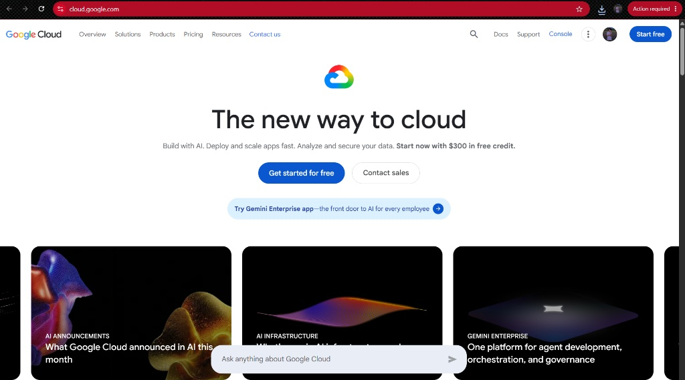

# Google Cloud Platform (GCP) Research Document

## Brief Overview
Google Cloud Platform (GCP), offered by Google, is a suite of public cloud computing services running on the same infrastructure that Google uses internally for products like Google Search, Gmail, and YouTube. Launched in 2008, GCP offers high-performance computing, advanced data analytics, and machine learning services.

## Global Infrastructure
GCP’s global network spans across multiple regions and zones worldwide connected by Google's private, high-speed fiber-optic network infrastructure. This global network backbone provides exceptionally low latency and high bandwidth for cloud applications.

## Cloud Management Console
The Google Cloud Console is a web-based portal providing a unified graphical interface to manage GCP resources, view real-time metrics, configure project security, and access Cloud Shell directly from the browser.

## Core Services
1. **Compute:** Google Compute Engine (GCE) – High-performance, customizable virtual machine instances.
2. **Storage:** Google Cloud Storage – Scalable object storage for structured and unstructured data with flexible storage classes.
3. **Networking:** Cloud VPC – Global Virtual Private Cloud networking that connects resources across multiple regions seamlessly.
4. **Identity:** Cloud IAM – Centralized identity and access management for fine-grained authorization rules.

## Advantages
- **Industry-Leading AI & Big Data:** Advanced native capabilities for data processing, machine learning models, and real-time analytics.
- **Pioneer in Containerization:** Native support and deep optimization for Kubernetes through Google Kubernetes Engine (GKE).
- **Global Backbone Network:** Utilizes Google's fast private global fiber network for optimal network performance.

## Typical Enterprise Use Cases
- Cloud-native microservices development and container orchestration using Kubernetes.
- Big data warehousing, real-time analytics, and streaming telemetry processing.
- Artificial Intelligence and Machine Learning model training and deployment at scale.
