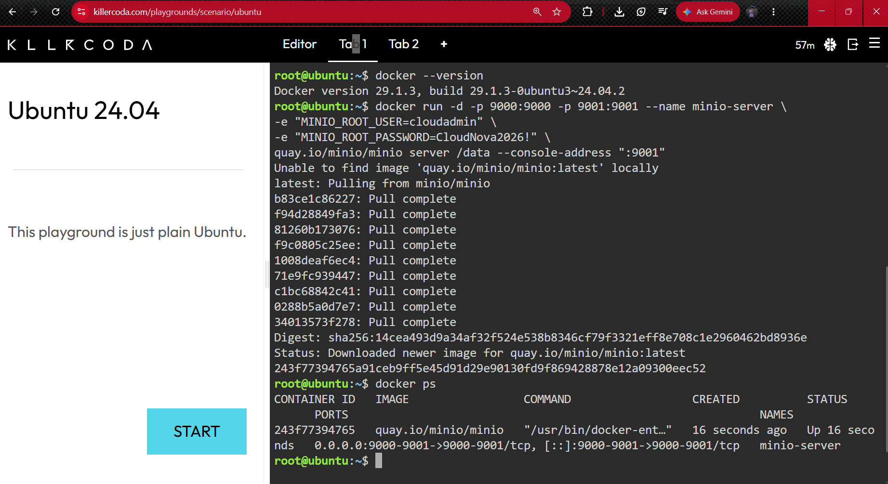
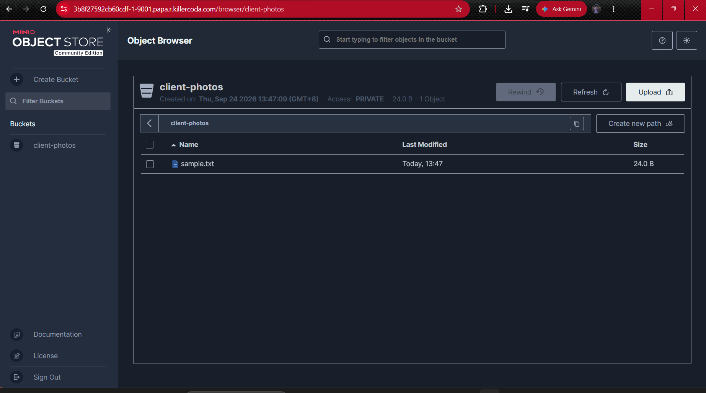

# Laboratory 05: The Cloud Data Engineer

## Mission Overview
This laboratory activity focuses on deploying an S3-compatible Object Storage server using MinIO running inside a Docker container within a cloud playground environment.

## Objectives
* Differentiate between Block, File, and Object Storage architectures.
* Deploy an S3-compatible Object Storage server (MinIO) using Docker.
* Configure port forwarding to access a containerized web console on port `9001`.
* Manage storage buckets and perform object uploads via a web interface.
* Document cloud data operations using professional Markdown standards.

## Tools Used
* **KillerCoda Playground:** Cloud-based Linux/Ubuntu terminal environment.
* **Docker Engine:** Containerization platform used to run MinIO.
* **MinIO:** Open-source, high-performance, S3-compatible object storage suite.
* **GitHub:** Portfolio repository and Markdown documentation hosting.

## Skills Learned
* Deploying multi-port Docker services configured with environment variables (`-e`).
* Managing object storage buckets and access paradigms.
* Linking ephemeral compute containers to persistent storage services.
* Documenting technical infrastructure configurations.

## 📂 Repository Structure & Artifacts

- **[Storage Types Research](storage-types-research.md)**: Comparative analysis of Block, File, and Object Storage architectures.
- **[MinIO Deployment Guide](minio-deployment.md)**: Deployment steps, commands, and container verification.
- **[Reflection & Verification](reflection.md)**: Key learnings, challenges encountered, and troubleshooting insights.

## 📸 Deployment Evidence

| MinIO Container Status | Bucket Creation & Upload |
| :---: | :---: |
|  |  |
